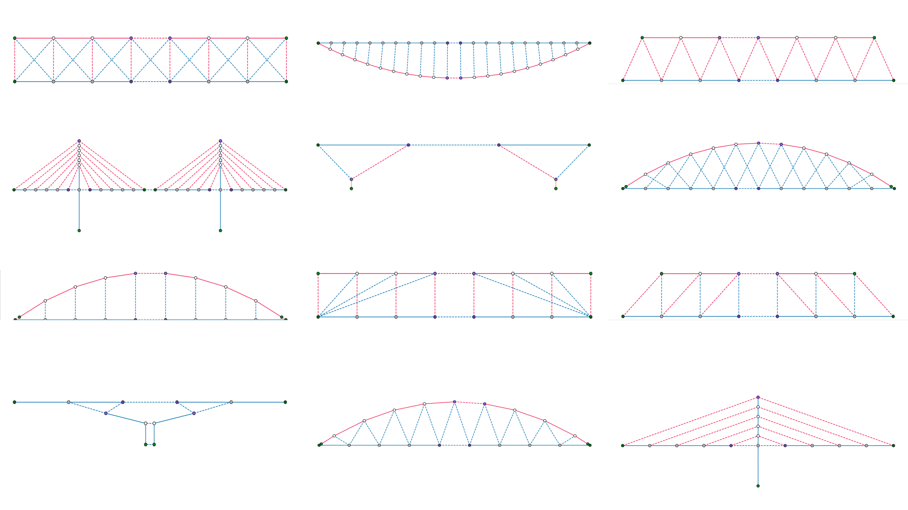

<h1 align='center'>The tower and the bridge</h1>



**Work in progress! Stay tuned for more details on this dataset.**

The tower and the bridge is a dataset of 3D bar structures in static equilibrium.
The structures in this repository are modeled as graphs. 
One graph encodes the topology, the geometry and the internal forces of a structure.

The goal of this dataset is to foster the development of new methods for structural design powered by graph-machine learning techniques.
We look forward to hearing how you use these graph-structured data in your research projects!

## Citation

If this dataset is helpful to your work, please consider citing it:

``` bibtex
@software{tower_bridge_dataset,
    title={{The Tower and the Bridge}: A dataset of topologies, forms and forces},
    author={Pastrana, Rafael and Adriaenssens, Sigrid},
    year={2022},
    url={https://github.com/arpastrana/tower_bridge},
    note={https://github.com/arpastrana/tower_bridge}
    }
```

## Acknowledgements

This work has been supported by the **U.S. National Science Foundation** under grant **OAC-2118201** and the [Institute for Data Driven Dynamical Design](https://www.mines.edu/id4/).

## See also

[JAX FDM](https://github.com/arpastrana/jax_fdm): Auto-differentiable and hardware accelerated force density method.

[COMPAS CEM](https://github.com/arpastrana/compas_cem): Inverse design of 3D trusses with the extended Combinatorial Equilibrium Modeling framework.

## License

MIT
